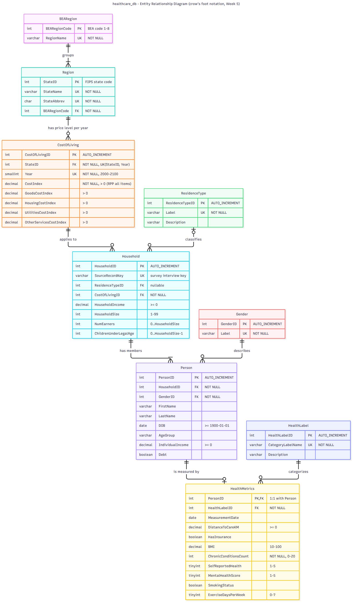

# The Cost-of-Living Health Gap: healthcare_db (Group 6)

**Repository:** <https://github.com/dmohrweiss/DBGroup6>

Healthcare inequality is being made worse by the rising cost of living. This MySQL database links **household economics**, the **local cost of living** and **individual health outcomes**, so policymakers, healthcare professionals and social support systems can see where economic strain and poor health come together. Since Week 5 it holds **real, openly licensed data** from the U.S. CDC (health survey) and the U.S. Bureau of Economic Analysis (price levels).

---

## Project overview by week

| Week | Deliverable | Where |
|---|---|---|
| 1 | Societal problem definition | [Design report §1](docs/design_report.md#1-business-domain-and-societal-problem) (also the opening slides of the Week-4 video) |
| 2 | ERD and normalization | Original: [Week-2 report (PDF)](docs/week2/week2_erd_normalization_report.pdf) · [Week-2 ERD](docs/week2/week2_erd.png) · **Updated in Week 5:** [design report](docs/design_report.md), including [normalization](docs/design_report.md#4-normalization-from-the-raw-data-to-3nfbcnf) and the [violations found in Week 5](docs/design_report.md#49-normal-form-violations-found-in-week-5-addendum-to-the-week-2-report) |
| 3 | Schema, constraints, mock data, example queries | [`healthcare_db_schema.sql`](healthcare_db_schema.sql) · [constraint rationale](docs/design_report.md#5-constraints) · [`advanced_queries.sql`](advanced_queries.sql) · [`BasicSQL.sql`](BasicSQL.sql) · original Week-3 version incl. mock data: [commit b10c2e8](https://github.com/dmohrweiss/DBGroup6/tree/b10c2e856c2a9fb85af3746d6825ea9fb1d2c450) |
| 4 | Stakeholder video | [below](#week-4-stakeholder-video) |
| 5 | Real-world data integration | [**Week-5 report**](docs/week5_real_data_integration.md) · [`etl/`](etl) · [`healthcare_db_load_data.sql`](healthcare_db_load_data.sql) · [query results](docs/query_results) · [constraint tests](docs/constraint_tests) |

## Entity Relationship Diagram (current)

The ERD uses crow's-foot notation; [`docs/erd.svg`](docs/erd.svg) is the full-resolution version. The original Week-2 ERD is [here](docs/week2/week2_erd.png).



## Week 4: Stakeholder video

**[▶ Watch the stakeholder presentation (7 min, MP4)](docs/week4/week4_stakeholder_video.mp4)**

The talk covers the societal challenge, our solution, two key insights, limitations and assumptions, and future work. Its limitations and future work are revisited with real data in [Week-5 report §8](docs/week5_real_data_integration.md#8-limitations-and-future-work-from-the-stakeholder-video-week-4-revisited).

<!-- To show an inline player instead of a link: edit this README on github.com, drag
     docs/week4/week4_stakeholder_video.mp4 into the editor (GitHub uploads it and inserts a
     https://github.com/user-attachments/assets/... link), and put that link on its own line here. -->

## Data sources (Week 5)

| Dataset | Publisher | Published | License | Used |
|---|---|---|---|---|
| [Behavioral Risk Factor Surveillance System (BRFSS) 2023](https://www.cdc.gov/brfss/annual_data/annual_2023.html) | U.S. Centers for Disease Control and Prevention | Sep 2024 (codebook Feb 2025) | Public domain ([CDC policy](https://www.cdc.gov/other/agencymaterials.html)) | 500 respondents (100 each: CA, NY, IL, WV, MS) |
| [Regional Price Parities by State (SARPP)](https://www.bea.gov/data/prices-inflation/regional-price-parities-state-and-metro-area) | U.S. Bureau of Economic Analysis | 19 Feb 2026 | Public domain ([BEA policy](https://www.bea.gov/help/faq/145)) | 50 states + DC × 2008–2024 |

Source: U.S. Centers for Disease Control and Prevention; U.S. Bureau of Economic Analysis. Use of this data does not imply endorsement by either agency.

## Installation

Requires **MySQL 8.0.16 or newer**; `CHECK` constraints are not enforced in older versions. Run the commands **from the repository root**, because the load script reads the CSV files in `data/` with relative paths.

```bash
git clone https://github.com/dmohrweiss/DBGroup6.git
cd DBGroup6

# once, as an admin user: allow LOAD DATA LOCAL on the server
mysql -u root -p -e "SET GLOBAL local_infile = 1;"

mysql -u your_username -p < healthcare_db_schema.sql                      # tables and constraints
mysql -u your_username -p < healthcare_db_lookup.sql                      # fixed lookup values
mysql --local-infile=1 -u your_username -p < healthcare_db_load_data.sql  # bulk-load the real data (CSV)
mysql -u your_username -p < advanced_queries.sql                          # example queries
```

**Using MySQL Workbench instead?**
1. Add `OPT_LOCAL_INFILE=1` under *Connection → Advanced → Others*.
2. In `healthcare_db_load_data.sql`, replace the relative CSV paths with absolute paths (Workbench does not start in the repository folder).

### Regenerating the CSV files (optional)

The cleaned CSV files in `data/processed/` are committed, so this is only needed to reproduce them. It requires Python 3.10+ (standard library only) and downloads about 60 MB.

```bash
python etl/fetch_data.py     # downloads both sources into data/raw/ (not committed)
python etl/clean_brfss.py    # -> data/extract/brfss_2023_sample_raw.csv, data/processed/brfss_2023_clean.csv
python etl/clean_bea.py      # -> data/extract/bea_sarpp_raw.csv, data/processed/bea_*.csv
```

## Repository structure

```
healthcare_db_schema.sql      tables, keys and constraints
healthcare_db_lookup.sql      lookup values (gender, residence type, health label, BEA region)
healthcare_db_load_data.sql   bulk load of the real data: LOAD DATA -> staging tables -> INSERT ... SELECT
advanced_queries.sql          example queries (Week 3, adapted in Week 5, + 2 new)
BasicSQL.sql                  basic UPDATE / INSERT / DELETE examples
etl/                          download and cleaning scripts (Python)
data/extract/                 raw (uncleaned) rows used from each source
data/processed/               cleaned CSV files (loaded by healthcare_db_load_data.sql) + missing-data profile
data/raw/MANIFEST.txt         download dates and server timestamps of the source files
docs/design_report.md         updated Week-2 report: domain, ERD, normalization, constraints
docs/week5_real_data_integration.md   Week-5 report
docs/erd.mmd / erd.png / erd.svg      current ERD
docs/week2/                   original Week-2 report and ERD
docs/week4/                   stakeholder video
docs/query_results/           output of all queries, before and after adaptation
docs/constraint_tests/        constraint and referential-action tests with their output
```
