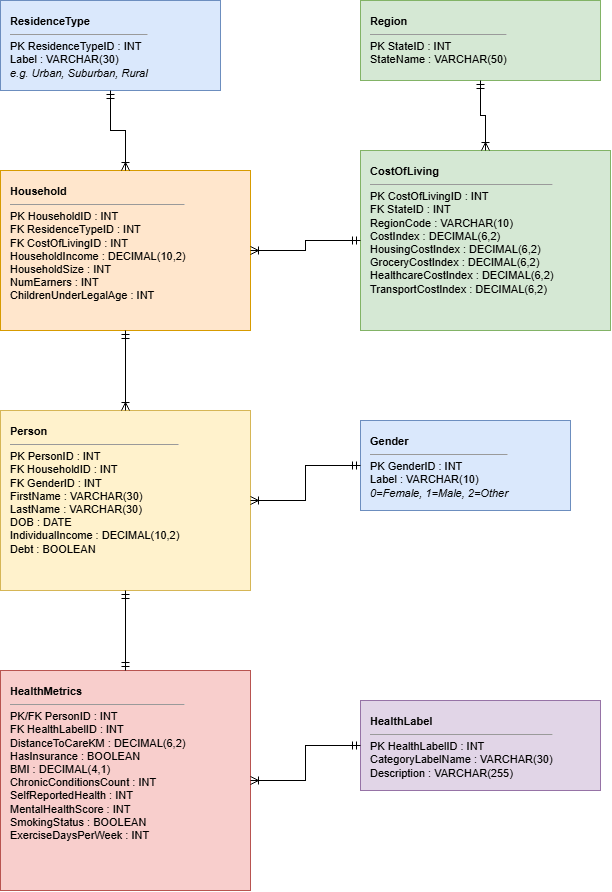

# healthcare_db: Design Report (ERD, Normalization, Constraints)

**Group 6** · Repository: <https://github.com/dmohrweiss/DBGroup6>

This is the **updated version of our Week-2 report** ([original PDF, 11 Sep 2026](week2/week2_erd_normalization_report.pdf)). It documents the domain, the role of each table, the ERD, the step-by-step normalization and the constraints.

The Week-2 content is kept: the original ERD is in [§3](#3-entity-relationship-diagram) and the original normalization steps are in [§4.0](#40-week-2-normalization-original-report). The report was extended in Week 5 for two reasons:
- the Week-3 feedback asked for the ERD, the functional dependencies and the normalization reasoning to be part of the repository;
- testing the design against real-world data revealed normal-form violations that the Week-2 version had missed ([§4.9](#49-normal-form-violations-found-in-week-5-addendum-to-the-week-2-report)).

What changed, and why, is summarised in [§6](#6-changes-since-week-3) and explained in detail in [week5_real_data_integration.md](week5_real_data_integration.md).

---

## 1. Business domain and societal problem

**The Cost-of-Living Health Gap** (from our stakeholder presentation, Week 4):

> **Aggravated healthcare inequality.** Healthcare inequality is being heavily aggravated by the rising cost of living. Vulnerable individuals unable to heat homes or afford proper nutrition arrive at hospitals significantly more unwell.
>
> **Our project mission.** Health is a fundamental right that should not depend on economic status. Our project aims to bridge this gap by analysing key socioeconomic health data. Tracking this data helps policymakers, healthcare professionals and social support systems target interventions where needed most.

The database tracks how economic strain correlates with physical and mental health outcomes. It connects three kinds of data:
- **regional economic data:** cost-of-living indices, housing costs;
- **household profiles:** urban/suburban/rural, total household income, family size;
- **individual demographics and health:** BMI, chronic conditions, mental health, smoking and lifestyle, proximity to medical care.

The real data added in Week 5 makes the cost-of-living point concrete: a household's nominal income says little on its own, because **$60,000 goes much further in Mississippi than in California**. The questions the database answers:

| Perspective | Questions the database answers |
|---|---|
| **Household economics** | Which households have below-average income *after correcting for local prices*? |
| **Cost of living** | How expensive are housing, goods and utilities in a state, and how has that changed since 2008? |
| **Health outcomes** | Which individuals combine many chronic conditions, poor self-rated health, poor mental health or no insurance? |

## 2. Tables and their roles

| Table | Role | Grain (one row = …) | Source of real data |
|---|---|---|---|
| `BEARegion` | Lookup: BEA economic region (e.g. *Far West*) | one region | BEA |
| `Region` | One **US state** (or DC), identified by its FIPS code | one state | BEA (+ CDC uses the same FIPS codes) |
| `CostOfLiving` | Price level of a state in a year (index, US = 100) | state × year | BEA Regional Price Parities |
| `ResidenceType` | Lookup: Urban / Suburban / Rural | one type | — |
| `Household` | Economic unit: income, size, children; observed in one state-year | one household | CDC BRFSS |
| `Gender` | Lookup | one value | — |
| `Person` | An individual living in a household | one person | CDC BRFSS |
| `HealthLabel` | Lookup: risk category (Optimal … Critical Risk) | one category | — |
| `HealthMetrics` | A person's health measurements (1:1 with `Person`) | one person | CDC BRFSS |

> **Naming note.** `Region` holds *states*, while BEA uses "Region" for multi-state areas. The table name was kept so the Week-3 queries keep working, and BEA's regions became the separate table `BEARegion`.

## 3. Entity Relationship Diagram

**Week-2 ERD (original).** Drawn in Week 2; also in the [Week-2 report](week2/week2_erd_normalization_report.pdf).



**Current ERD (Week 5).** Updated after testing with real data. The changes are listed in [§6](#6-changes-since-week-3); the most visible ones are:
- `RegionCode` moved out of `CostOfLiving`;
- `CostOfLiving` now has a `Year` and BEA's price categories;
- a `BEARegion` table was added;
- all keys, constraints and cardinalities are shown.

The diagram uses crow's-foot notation throughout:
- `||` = exactly one
- `o|` = zero or one
- `|{` = one or more
- `o{` = zero or more

Source: [`erd.mmd`](erd.mmd) (Mermaid; GitHub renders it). Image: [`erd.png`](erd.png) / [`erd.svg`](erd.svg).


**Cardinalities explained**

| Relationship | Cardinality | Meaning |
|---|---|---|
| BEARegion – Region | 1 to 1..* | every state is in exactly one BEA region; every region has at least one state |
| Region – CostOfLiving | 1 to 0..* | a state has one price record per published year |
| CostOfLiving – Household | 1 to 0..* | a household is observed in exactly one state-year |
| ResidenceType – Household | 0..1 to 0..* | the residence type is optional (`NULL` when a county cannot be classified) |
| Household – Person | 1 to 1..* | a household has members; a person belongs to exactly one household |
| Gender – Person | 1 to 0..* | |
| Person – HealthMetrics | 1 to 0..1 | a person has at most one health record; a health record belongs to exactly one person (shared primary key) |
| HealthLabel – HealthMetrics | 1 to 0..* | |

## 4. Normalization: from the raw data to 3NF/BCNF

### 4.0 Week-2 normalization (original report)

Summary of the steps in our [Week-2 report](week2/week2_erd_normalization_report.pdf), based on an example household dataset:

| Step | Violation found | Fix |
|---|---|---|
| **1NF** (atomicity) | Several people squeezed into one column per household: `Household Members = "John, 1980-05-12, Male -- Jane, 1982-11-23, Female"` | one row per person, which became the `Person` entity |
| **2NF** (no partial dependencies) | With the composite key `(HouseholdID, PersonID)`, `HouseholdIncome`, `HouseholdSize` and `NumEarners` depend only on `HouseholdID`, so they are duplicated for every family member | split into `Household` and `Person`; `Person.HouseholdID` is a foreign key |
| **3NF** (no transitive dependencies) | `StateName` depends on the state, not on the household (`HouseholdID → StateID → StateName`); residence and gender labels stored as text | reference tables `Region` and `CostOfLiving`; lookup tables `ResidenceType` and `Gender` |

The Week-2 analysis stayed correct. Week 5 tested it against real source files, which have a different starting point (§4.1 to §4.8 below). That test showed one violation the Week-2 version still contained, `CostOfLiving.RegionCode`, plus several new ones caused by the shape of the real data. They are listed in [§4.9](#49-normal-form-violations-found-in-week-5-addendum-to-the-week-2-report).

### 4.1 Unnormalized starting point (UNF)

The starting point is the data as it actually arrives from our two real sources:
- **CDC BRFSS** delivers one long fixed-width line per respondent, 345 variables across 2,111 characters.
- **BEA** delivers one row per state × price category, with a separate column for every year.

Combined into a single "respondent sheet", one unnormalized record looks like this. Repeating groups are in `{ }`:

```
RespondentSheet(
  SourceRecordKey, StateFIPS, StateName, StateAbbrev, BEARegionCode, BEARegionName,
  InterviewDate ("MMDDYYYY" text), SexCode, AgeGroupCode,
  UrbanRuralCode, ResidenceDescription, Adults, Children, IncomeBracket,
  GenHealthCode, PoorMentalHealthDays, InsuranceCode, BMI_x100, SmokerCode, ExerciseFrequencyCode,
  { HeartAttack, CoronaryHD, Stroke, Asthma, COPD, Depression, KidneyDisease, Arthritis, Cancer, Diabetes },
  { Year, RPP_AllItems, RPP_Goods, RPP_Housing, RPP_Utilities, RPP_OtherServices } x 17 years (2008-2024),
  HealthLabelName, HealthLabelDescription )
```

This record breaks the normal forms in several ways:
- **Repeating groups.** The 17 year blocks of BEA price data, and the 10 condition flags, are the same kind of fact repeated in columns.
- **Non-atomic values.** `InterviewDate` is a code string, and the BEA `GeoFIPS` field arrives as `' "06000"'`, which combines the state code with a county suffix and quotes.
- **Massive redundancy.** The same state name, region name and 17 years of price data would be repeated for each of the 43,012 respondents in our five states.

### 4.2 Functional dependencies

Taken from the real data and the codebooks:

| # | Functional dependency | Comes from |
|---|---|---|
| FD1 | `SourceRecordKey → StateFIPS, InterviewDate, Sex, AgeGroup, UrbanRural, Adults, Children, Income, GenHealth, MentalHealth, Insurance, BMI, Smoker, Exercise, condition flags, HealthLabelName` | BRFSS: one record per respondent; (`_STATE`, `SEQNO`) is unique (verified: 0 duplicates in 433,323 rows) |
| FD2 | `StateFIPS → StateName, StateAbbrev, BEARegionCode` | a state has one name, abbreviation and BEA region |
| FD3 | `StateName → StateFIPS` and `StateAbbrev → StateFIPS` | names and abbreviations are unique (candidate keys) |
| FD4 | `BEARegionCode → BEARegionName` | BEA region definitions |
| FD5 | `(StateFIPS, Year) → RPP_AllItems, RPP_Goods, RPP_Housing, RPP_Utilities, RPP_OtherServices` | BEA: one value per state, category and year (verified: 0 duplicate `GeoFIPS`/`LineCode` rows) |
| FD6 | `HealthLabelName → HealthLabelDescription` | lookup |
| FD7 | `UrbanRural → ResidenceDescription` | lookup |
| FD8 | `HouseholdID → Income, HouseholdSize, Children, ResidenceType, (StateFIPS, Year)` | household-level facts (they describe the household, not the person) |
| FD9 | `{ChronicCount, SelfReportedHealth, MentalHealthScore, BMI, Smoking} → HealthLabelName` | *only* when the label is computed by our rule; see [4.6](#46-deliberate-decisions-and-remaining-dependencies) |

### 4.3 First normal form (1NF): atomic values, no repeating groups

| Problem | Resolution |
|---|---|
| 17 repeating year blocks of price indexes | **Unpivoted** into one row per (state, year): relation `PriceLevel(StateFIPS, Year, StateName, StateAbbrev, BEARegionCode, BEARegionName, RPP_…)`, key **(StateFIPS, Year)**. Done in `etl/clean_bea.py`. |
| 10 condition flags (a fixed list of yes/no columns) | Stored as the analytic measure `ChronicConditionsCount`. The individual flags are kept in the raw extract (`data/extract/`). A fully decomposed `Condition` / `PersonCondition` design is listed as future work. |
| `InterviewDate` = text `"07232023"` | Converted to an atomic `DATE` (`2023-07-23`) |
| `GeoFIPS` = `' "06000"'` (state + county + quotes) | Parsed to the integer state code `6` |
| `BMI_x100` = `4069` (implied decimals) | Converted to `40.7` |

After 1NF there are two relations: `Respondent(SourceRecordKey, …all FD1 attributes…, StateName, StateAbbrev, BEARegionCode, BEARegionName, HealthLabelDescription, ResidenceDescription)` and `PriceLevel(StateFIPS, Year, …)`.

### 4.4 Second normal form (2NF): no partial dependencies

`PriceLevel` has the composite key **(StateFIPS, Year)**, but `StateName`, `StateAbbrev`, `BEARegionCode` and `BEARegionName` depend on **StateFIPS alone** (FD2). That is a partial dependency.
- Decompose into `Region(StateFIPS, StateName, StateAbbrev, BEARegionCode, BEARegionName)` and `CostOfLiving(StateFIPS, Year, RPP_…)`.
- This is exactly the problem the Week-3 schema had with `CostOfLiving.RegionCode` (the state abbreviation): it depended on the state, not on the cost-of-living record. Once the real data introduced `Year`, it showed up as a 2NF violation; with the old single-column key `CostOfLivingID` it was a transitive dependency, i.e. a 3NF violation. **Resolution:** `RegionCode` was removed from `CostOfLiving` and lives in `Region.StateAbbrev`.

`Respondent` has a single-attribute key, so it is in 2NF automatically. It still has transitive dependencies, handled next.

### 4.5 Third normal form (3NF): no transitive dependencies

| Transitive dependency | Resolution (resulting table) |
|---|---|
| `StateFIPS → BEARegionCode → BEARegionName` (FD2 + FD4) | `BEARegion(BEARegionCode, RegionName)`; `Region` keeps only the FK |
| `SourceRecordKey → StateFIPS → StateName, …` (FD1 + FD2) | The respondent only references the state-year it was observed in: `Household.CostOfLivingID → CostOfLiving → Region` |
| `SourceRecordKey → HealthLabelName → Description` (FD6) | `HealthLabel` lookup table + `HealthMetrics.HealthLabelID` |
| `SourceRecordKey → UrbanRural → Description` (FD7) | `ResidenceType` lookup + `Household.ResidenceTypeID` |
| `Person → HouseholdID → Income, Size, Children, …` (FD8) | `Household` table; `Person.HouseholdID` FK. In BRFSS each household has only one surveyed person, but a household can have several people (`HouseholdSize` up to 10 in our sample), so household facts must not be repeated per person. |
| `CostOfLivingID → StateID → RegionCode` (Week-3 schema) | removed (see 4.4) |
| `Gender.GenderID ↔ Gender.Code` (Week 3: two columns always holding the same value) | `Code` removed: it was a redundant second key |

`Person` and `HealthMetrics` share the same key, so splitting them is *not* required for 3NF. They are kept separate on purpose:
- Health data is sensitive and can be access-restricted on its own.
- A person may exist without measurements (0..1).
- Deleting a person removes the health record (`ON DELETE CASCADE`).

### 4.6 Deliberate decisions and remaining dependencies

- **`HealthLabelID` is a derived attribute (FD9).** For the survey data we *assign* the label with a documented rule (`etl/clean_brfss.py → derive_health_label`). If the label were always computed that way, FD9 would be a transitive dependency and the label should become a view. We keep it stored because it is a **classification that may be overridden** by a professional. `BasicSQL.sql` UPDATE 1 escalates people to *Critical Risk* based on their mental health, which the rule does not do. So FD9 does not hold for the database as a whole.
- **Household income is a bracket midpoint.** BRFSS only publishes brackets. Only the midpoint is stored, never the bracket *and* the midpoint, which would create the dependency `Bracket → Midpoint`. The loss of precision is listed as a limitation.
- **`AgeGroup` vs `DOB`.** When both are known, `DOB + MeasurementDate → AgeGroup`. Survey data is de-identified, so in practice only one of the two is filled in. Computing `AgeGroup` in a view when `DOB` is known is future work.

### 4.7 BCNF check

| Table | Determinants | All candidate keys? |
|---|---|---|
| `Region` | `StateID`, `StateName`, `StateAbbrev` | yes (all `UNIQUE`) → BCNF |
| `CostOfLiving` | `CostOfLivingID`, `(StateID, Year)` | yes (`UNIQUE (StateID, Year)`) → BCNF |
| `BEARegion`, `Gender`, `ResidenceType`, `HealthLabel` | ID, label | yes (label `UNIQUE`) → BCNF |
| `Household`, `Person`, `HealthMetrics` | their PK (and `Household.SourceRecordKey`, `UNIQUE`) | yes → BCNF, given the decision on FD9 in 4.6 |

### 4.8 Before / after

| Week-3 schema | Final schema (Week 5) | Normal-form issue fixed |
|---|---|---|
| `CostOfLiving(CostOfLivingID, StateID, RegionCode, …)` | `CostOfLiving(CostOfLivingID, StateID, Year, …)` + `Region.StateAbbrev` | 3NF (transitive: ID → StateID → RegionCode) |
| no year in `CostOfLiving` | `UNIQUE (StateID, Year)` | real data has 17 years per state; one row per state could not hold them |
| `Gender(GenderID, Label, Code)` with `GenderID = Code` | `Gender(GenderID, Label)` | redundant duplicate key |
| BEA region not modelled | `BEARegion` + `Region.BEARegionCode` | 3NF (StateID → RegionCode → RegionName) |
| source data: wide year columns | long format, one row per state-year | 1NF (repeating group) |
| source data: one flat 2,111-char line per respondent | `Household` / `Person` / `HealthMetrics` + lookups | 1NF to 3NF (see above) |

### 4.9 Normal-form violations found in Week 5 (addendum to the Week-2 report)

| # | Violation | Normal form | Present in | Resolution |
|---|---|---|---|---|
| 1 | `CostOfLiving.RegionCode` (state abbreviation) depends on the state, not on the cost-of-living record | **3NF** (transitive: `CostOfLivingID → StateID → RegionCode`); **2NF** once `Year` became part of the natural key | **our Week-2/3 schema** (visible in the Week-2 ERD) | moved to `Region.StateAbbrev` |
| 2 | `Gender.Code` always equals `GenderID` | redundancy (two keys holding the same value) | our Week-2/3 schema | `Code` removed |
| 3 | Price indexes stored as one column per year (`2008` … `2024`) | **1NF** (repeating group) | BEA source file | unpivoted to one row per (state, year) |
| 4 | Non-atomic codes: `' "06000"'` (state + county + quotes), `'07232023'` (date as text), `4069` (BMI ×100) | **1NF** (atomicity) | both source files | parsed into integer FIPS code, `DATE`, `DECIMAL` |
| 5 | One flat record per respondent combining state, household, person and health facts | **2NF/3NF** | BRFSS source file | decomposed into `Household`, `Person`, `HealthMetrics` + lookups (§4.3–4.5) |
| 6 | `StateID → BEARegionCode → RegionName` | **3NF** (transitive) | BEA's `Region` column | new table `BEARegion` |
| 7 | `HealthLabelID` can be derived from the health metrics by our labelling rule | potential **3NF** | survey data | kept on purpose; a professional can override the label (§4.6) |

## 5. Constraints

The Week-3 feedback asked four questions. This is how the schema ([`healthcare_db_schema.sql`](../healthcare_db_schema.sql)) answers them. Every constraint was tested against real data ([section 4 of the Week-5 report](week5_real_data_integration.md#4-schema-and-constraint-check)).

### 5.1 Nullability: what is mandatory?

- **`NOT NULL`:**
  - every FK without which a row makes no sense: `Person.HouseholdID`, `Person.GenderID`, `Household.CostOfLivingID`, `HealthMetrics.HealthLabelID`, `CostOfLiving.StateID`, `Region.BEARegionCode`
  - all lookup labels, `Region.StateName`/`StateAbbrev`, `CostOfLiving.Year`/`CostIndex`
  - `HealthMetrics.ChronicConditionsCount` (`DEFAULT 0`)
- **Nullable**, because the real data showed these are genuinely unknown for some records:
  - `HouseholdIncome`: 20% "don't know/refused/not asked" in the 5-state population
  - `BMI`: height or weight missing (10%)
  - `HasInsurance`, `SmokingStatus`, `ExerciseDaysPerWeek`, `MentalHealthScore`, `SelfReportedHealth`, `HouseholdSize`, `ChildrenUnderLegalAge`: "don't know/refused" answers
  - `ResidenceTypeID`: county not classifiable
  - `FirstName`, `LastName`, `DOB`: survey data is de-identified
  - `DistanceToCareKM`, `NumEarners`, `IndividualIncome`, `Debt`: not collected by the source
- In SQL, a `CHECK` on a NULL value evaluates to *unknown* and passes. So the domain checks below restrict known values without forbidding unknown ones.

### 5.2 Referential integrity: what happens on delete/update?

| FK | `ON DELETE` | `ON UPDATE` | Reason |
|---|---|---|---|
| `HealthMetrics.PersonID → Person` | **CASCADE** | CASCADE | health record is a weak entity of the person; no orphans |
| `Person.HouseholdID → Household` | **RESTRICT** | CASCADE | a household with members must not disappear silently; delete the members first |
| `Household.CostOfLivingID → CostOfLiving` | RESTRICT | CASCADE | official statistics cannot be removed while households refer to them |
| `CostOfLiving.StateID → Region`, `Region.BEARegionCode → BEARegion` | RESTRICT | CASCADE | reference data |
| `Household.ResidenceTypeID`, `Person.GenderID`, `HealthMetrics.HealthLabelID` → lookups | RESTRICT | CASCADE | a lookup value in use cannot be deleted; renumbering propagates |

All five behaviours were demonstrated on the real data: [`constraint_tests/referential_actions_output.txt`](constraint_tests/referential_actions_output.txt).

### 5.3 Key generation

- All entity and lookup tables use **`AUTO_INCREMENT`** surrogate keys.
- No ID is ever typed in.
  - **Bulk load** ([`healthcare_db_load_data.sql`](../healthcare_db_load_data.sql)): `LOAD DATA` stages the CSV files, then `INSERT … SELECT` resolves every foreign key by joining on a natural key:
    - lookup label → lookup ID;
    - (state, year) → `CostOfLivingID`;
    - survey record key → `HouseholdID` → `PersonID`.
  - **Single rows** ([`BasicSQL.sql`](../BasicSQL.sql)): `LAST_INSERT_ID()` links a new `Person` to the `Household` just inserted.
- Deliberate exceptions use natural keys published by the source:
  - `Region.StateID` = official **FIPS** state code. It is the key that links the two real-world datasets.
  - `BEARegion.BEARegionCode` = BEA's own region code.
- `HealthMetrics.PersonID` is borrowed from `Person` (1:1).

### 5.4 Domain bounds: preventing impossible values

| Column | Constraint | Rationale |
|---|---|---|
| `BMI` | `BETWEEN 10 AND 100` (+ `DECIMAL(4,1)`) | physiologically possible range (BRFSS stores up to 99.99; our sample: 14.6–61.7) |
| `SelfReportedHealth`, `MentalHealthScore` | `BETWEEN 1 AND 5` | ordinal scales |
| `ExerciseDaysPerWeek` | `BETWEEN 0 AND 7` | days in a week |
| `ChronicConditionsCount` | `BETWEEN 0 AND 20` | non-negative count |
| `HasInsurance`, `SmokingStatus` | `IN (0, 1)` | `BOOLEAN` in MySQL is a `TINYINT` and would otherwise accept 2–127 |
| `HouseholdSize` | `BETWEEN 1 AND 99` | at least the respondent |
| `ChildrenUnderLegalAge` | `>= 0 AND < HouseholdSize` | children are part of the household, and there is at least one adult |
| `NumEarners` | `>= 0 AND <= HouseholdSize` | |
| `HouseholdIncome`, `IndividualIncome`, `DistanceToCareKM` | `>= 0` | |
| `CostIndex` and sub-indexes | `> 0` | price index |
| `CostOfLiving.Year` | `BETWEEN 2000 AND 2100` | |
| `Region.StateID` | `BETWEEN 1 AND 78` | FIPS state/territory range |
| `Person.DOB` | `>= '1900-01-01'` | (MySQL does not allow `CURDATE()` in a `CHECK`) |
| `UNIQUE` | `Region.StateName`, `Region.StateAbbrev`, `(CostOfLiving.StateID, Year)`, lookup labels, `Household.SourceRecordKey` | no duplicate states, years, labels or loaded survey interviews |

## 6. Changes since Week 3

| Change | Triggered by |
|---|---|
| `AUTO_INCREMENT` keys; bulk load resolves IDs by joining on natural keys | feedback: key generation |
| `NOT NULL`, `CHECK`, `UNIQUE`, `ON DELETE/UPDATE` actions | feedback: nullability, referential integrity, domain bounds |
| `CostOfLiving`: + `Year`, − `RegionCode`, BEA categories instead of Grocery/Healthcare/Transport, `DECIMAL(7,3)` | real data (BEA) + 3NF |
| `Region.StateID` = FIPS code; + `StateAbbrev`, `BEARegionCode`; new `BEARegion` | real data: shared key of both sources; 3NF |
| `Gender.Code` removed | redundancy |
| `Household`: + `SourceRecordKey` (survey interview key, `UNIQUE`) | real data: provenance, duplicate protection, key for the bulk load |
| `Person`: + `AgeGroup`; names/DOB optional | real data (de-identified survey, age bands only) |
| `HealthMetrics`: + `MeasurementDate` | real data (interview date) |
| Synthetic mock data removed (still available in the [Week-3 version of the repository](https://github.com/dmohrweiss/DBGroup6/tree/b10c2e856c2a9fb85af3746d6825ea9fb1d2c450)) | replaced by real data |
